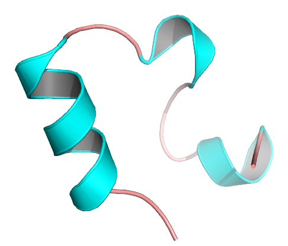
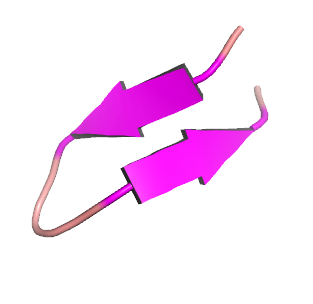

# Protein Structure Prediction Using Threading

This project focuses on protein structure prediction using the [threading (fold recognition) method](https://en.wikipedia.org/wiki/Threading_(protein_sequence)). Threading is a computational approach that aligns a protein sequence with known template structures to predict its 3D structure, even when sequence similarity is low. This method identifies candidate templates by considering structural similarities, such as predicted secondary structures and solvent accessibility. By mapping the sequence onto structurally similar templates, threading can accurately predict protein folds, making it a valuable tool in bioinformatics, medicine, and biotechnology.

<p align="center">
  
</p>
<p align="center">
  <i>
    Fig. 1: Protein fold recognition summary.
  </i>
</p>


## Installation

### Clone the repository

```bash
git clone git@github.com:zhukovanadezhda/protein-threading.git
cd protein-threading
```
### Setup the conda environment

Install [miniconda](https://docs.conda.io/en/latest/miniconda.html). Create the `protein-threading` conda environment:

```bash
conda env create -f environment.yml
```

### Load the environment

```bash
conda activate protein-threading
```

> **Note:** To deactivate an active environment, use:
> ```bash
> conda deactivate
> ```

## Usage

> **Note:** Before running the program, ensure the `src/config.py` file is properly configured to set up your working directories.  
> - **To run an example:** Select one of the provided example directories (e.g., `data/example1`).  
> - **To use custom data:** Create your own directory (e.g., `data/your_dir`) with subdirectories for `sequences` and `structures`. Place your data in these folders and update the paths in `src/config.py`.
>   
> Example `src/config.py` modification:
> ```python
> # Directory paths
> TEMPLATES_DIR = 'data/your_dir/structures/'
> SEQUENCES_DIR = 'data/your_dir/sequences/'
> ```

To run the program, use the following command:

```python
python src/main.py [-h] [--sequences SEQUENCES] [--templates TEMPLATES] [--output_file OUTPUT_FILE] \
                   [--jobs JOBS] [--dry_run] [--verbose]
```

## Arguments

| Argument                  | Description                                                   | Default           |
|:-------------------------:|---------------------------------------------------------------|-------------------|
| `-h`                      | Show a help message and exit.                                 |                   |
| `--sequences`             | Comma-separated list of sequence filenames (`.fasta` format). | All files from `SEQUENCES_DIR` from `src/config.py`. |
| `--templates`             | Comma-separated list of template filenames (`.pdb` format).   | All files from `TEMPLATES_DIR` from `src/config.py`. |
| `--output_file`           | Name of the output CSV file.                                  | `results/energy_scores.csv`|
| `--jobs`                  | Number of parallel jobs to run.                               | All cores         |
| `--dry_run`               | If set, only log actions without processing.                  | False (not set)   |
| `--verbose`               | If set, verbose output enabled.                               | False (not set)   |

<p align="center">
  <i>
    Table 1: Program parameters.
  </i>
</p>

## Examples

### Example 1: Small proteins <50 amino acids (time of execution: <5 min)

#### Input

> `src/config.py` :
> ```python
> # Directory paths
> TEMPLATES_DIR = 'data/example1/structures/'
> SEQUENCES_DIR = 'data/example1/sequences/'
> ```

```python
python src/main.py --sequences 1CRN.fasta,1L2Y.fasta,1VII.fasta,5AWL.fasta --output_file results/example1_result.csv
```

#### Results

<div style="text-align:center;">
  <table align="center">
    <thead>
      <tr>
        <th style="text-align:center;"> </th>
        <th style="text-align:center; width: 150px;">1crn.pdb</th>
        <th style="text-align:center; width: 150px;">1l2y.pdb</th>
        <th style="text-align:center; width: 150px;">1le0.pdb</th>
        <th style="text-align:center; width: 150px;">1le1.pdb</th>
        <th style="text-align:center; width: 150px;">1vii.pdb</th>
        <th style="text-align:center; width: 150px;">5awl.pdb</th>
      </tr>
    </thead>
    <tbody>
      <tr>
        <td> </td>
        <td><p align="center">46 aa</p></td>
        <td><p align="center">20 aa</p></td>
        <td><p align="center">12 aa</p></td>
        <td><p align="center">12 aa</p></td>
        <td><p align="center">36 aa</p></td>
        <td><p align="center">10 aa</p></td>
      </tr>
      <tr>
        <td><p align="center">1CRN.fasta</p></td>
        <td><p align="center"><i><b>-283.99</b></i></p></td>
        <td><p align="center">-35.37</p></td>
        <td><p align="center">-10.5</p></td>
        <td><p align="center">-13.05</p></td>
        <td><p align="center">-162.04</p></td>
        <td><p align="center">-9.02</p></td>
      </tr>
      <tr>
        <td><p align="center">1L2Y.fasta</p></td>
        <td><p align="center">-14.77</p></td>
        <td><p align="center"><b><i>-67.4</p></b></i></td>
        <td><p align="center">-19.18</p></td>
        <td><p align="center">-20.23</p></td>
        <td><p align="center">-41.71</p></td>
        <td><p align="center">-17.53</p></td>
      </tr>
      <tr>
        <td><p align="center">1VII.fasta</p></td>
        <td><p align="center">-157.37</p></td>
        <td><p align="center">-24.16</p></td>
        <td><p align="center">7.61</p></td>
        <td><p align="center">7.23</p></td>
        <td><p align="center"><b><i>-169.07</b></i></p></td>
        <td><p align="center">6.95</p></td>
      </tr>
      <tr>
        <td><p align="center">5AWL.fasta</p></td>
        <td><p align="center">6.73</p></td>
        <td><p align="center">-19.18</p></td>
        <td><p align="center">-28.12</p></td>
        <td><p align="center">-28.32</p></td>
        <td><p align="center">3.62</p></td>
        <td><p align="center"><b><i>-32.68</i></b></p></td>
      </tr>
      <tr>
        <td></td>
        <td></td>
        <td></td>
        <td></td>
        <td></td>
        <td></td>
        <td></td>
      </tr>
    </tbody>
  </table>
</div>

<p align="center">
  <i>
    Table 2: Summary of results from the first example.<br>
    "aa" stands for amino acids; bold indicates the best score, italics indicate the correct match.
  </i>
</p>


### Example 2: Middle-size proteins 70-120 amino acids (time of execution: >10h)

#### Input

> `src/config.py` :
> ```python
> # Directory paths
> TEMPLATES_DIR = 'data/example2/structures/'
> SEQUENCES_DIR = 'data/example2/sequences/'
> ```


```python
python src/main.py --output_file results/example2_result.csv
```

#### Results

<div style="text-align:center;">
  <table align="center">
    <thead>
      <tr>
        <th style="text-align:center;"> </th>
        <th style="text-align:center; width: 150px;">1e68.pdb</th>
        <th style="text-align:center; width: 150px;">1ubq.pdb</th>
        <th style="text-align:center; width: 150px;">3zow.pdb</th>
        <th style="text-align:center; width: 150px;">3e8v.pdb</th>
        <th style="text-align:center; width: 150px;">1tit.pdb</th>
        <th style="text-align:center; width: 150px;">1tvd.pdb</th>
        <th style="text-align:center; width: 150px;">3zbv.pdb</th>
      </tr>
    </thead>
    <tbody>
      <tr>
        <td><p align="center"></p></td>
        <td><p align="center">70 aa</p></td>
        <td><p align="center">76 aa</p></td>
        <td><p align="center">81 aa</p></td>
        <td><p align="center">82 aa</p></td>
        <td><p align="center">89 aa</p></td>
        <td><p align="center">116 aa</p></td>
        <td><p align="center">118 aa</p></td>
      </tr>
      <tr>
        <td><p align="center">1E68.fasta <br> </p></td>
        <td><p align="center"><i>-10761.13</i></p></td>
        <td><p align="center">-12968.85</p></td>
        <td><p align="center">-13892.91</p></td>
        <td><p align="center">-13937.92</p></td>
        <td><p align="center">-12498.24</p></td>
        <td><p align="center"><b>-17037.28</b></p></td>
        <td><p align="center">-16702.83</p></td>
      </tr>
      <td><p align="center">3E8V.fasta <br> </p></td>
        <td><p align="center"></p>-14196.34</p></td>
        <td><p align="center"></p>-16873.19</p></td>
        <td><p align="center"></p>-18082.49</p></td>
        <td><p align="center"></p><i>-18373.36<i></p></td>
        <td><p align="center"></p>-16229.49</p></td>
        <td><p align="center"></p><b>-21858.97</b></p></td>
        <td><p align="center"></p>-21617.74</p></td>
      </tr>
      <tr>
        <td></td>
        <td></td>
        <td></td>
        <td></td>
        <td></td>
        <td></td>
        <td></td>
        <td></td>
      </tr>
    </tbody>
  </table>
</div>
          
<p align="center">
  <i>
    Table 3: Summary of results from the second example.<br>
    "aa" stands for amino acids; bold indicates the best score, italics indicate the correct match.
  </i>
</p>


## Contact

For questions or issues, please open an issue on GitHub or contact [nadiajuckova@gmail.com](mailto:nadiajuckova@gmail.com).
