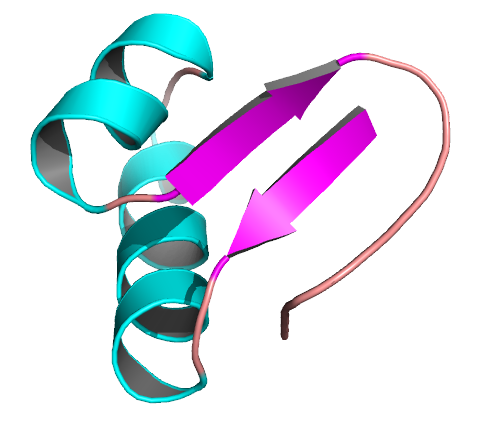
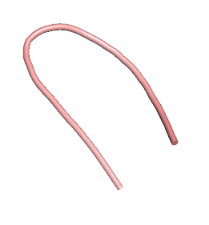
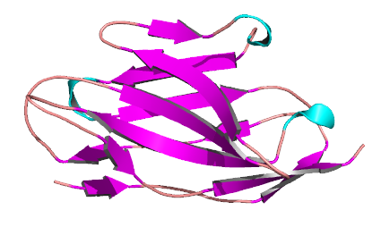

# Protein Structure Prediction Using Threading

This project focuses on protein structure prediction using the [threading (fold recognition) method](https://en.wikipedia.org/wiki/Threading_(protein_sequence)). Threading is a computational approach that aligns a target protein sequence with known structures to predict its 3D structure, even when sequence similarity is low. This method identifies candidate templates by considering both sequence and structural similarities, such as predicted secondary structures and solvent accessibility. By mapping the target sequence onto structurally similar templates, threading can accurately predict protein folds, making it a valuable tool in bioinformatics, medicine, and biotechnology.

<p align="center">
  
</p>
<p align="center">
  <i>
    Fig. 1: Protein fold recognition summary.
  </i>
</p>


## Installation

### Clone the repository

```bash
git clone git@github.com:zhukovanadezhda/protein-threading.git
cd protein-threading
```
### Setup the conda environment

Install [miniconda](https://docs.conda.io/en/latest/miniconda.html). Create the `protein-threading` conda environment:

```bash
conda env create -f environment.yml
```

### Load the environment

```bash
conda activate protein-threading
```

> **Note:** to deactivate an active environment, use:
> ```bash
> conda deactivate
> ```

## Usage

> **Note:** Before running the program, ensure the `src/config.py` file is properly configured to set up your working directories.  
> - **To run an example:** Select one of the provided example directories (e.g., `data/example1`).  
> - **To use custom data:** Create your own directory (e.g., `data/your_dir`) with subdirectories for `sequences` and `structures`. Place your data in these folders and update the paths in `src/config.py`.
>   
> Example `src/config.py` modification:
> ```python
> # Directory paths
> TEMPLATES_DIR = 'data/your_dir/structures/'
> SEQUENCES_DIR = 'data/your_dir/sequences/'
> ```

To run the program, use the following command:

```python
python src/main.py [-h] [--sequences SEQUENCES] [--templates TEMPLATES] [--output_file OUTPUT_FILE] \
                   [--jobs JOBS] [--dry_run] [--verbose]
```

## Arguments

| Argument                  | Description                                                   | Default           |
|:-------------------------:|---------------------------------------------------------------|-------------------|
| `-h`                      | Show a help message and exit.                                 |                   |
| `--sequences`             | Comma-separated list of sequence filenames (`.fasta` format). | All files from `SEQUENCES_DIR` from `src/config.py`. |
| `--templates`             | Comma-separated list of template filenames (`.pdb` format).   | All files from `TEMPLATES_DIR` from `src/config.py`. |
| `--output_file`           | Name of the output CSV file.                                  | `results/energy_scores.csv`|
| `--jobs`                  | Number of parallel jobs to run.                               | All cores         |
| `--dry_run`               | If set, only log actions without processing.                  | False (not set)   |
| `--verbose`               | If set, verbose output enabled.                               | False (not set)   |

## Examples

### Example 1: Small proteins <50 amino acids (time of execution: <5 min)

#### Input

> `src/config.py` :
> ```python
> # Directory paths
> TEMPLATES_DIR = 'data/example1/structures/'
> SEQUENCES_DIR = 'data/example1/sequences/'
> ```

```python
python src/main.py --sequences 5AWL.fasta --output_file results/example1_result.csv
```

#### Output

```python
2024-09-06 13:30:02,290 - INFO - Loading DOPE score data...
2024-09-06 13:30:02,732 - INFO - Processing sequences and templates...
2024-09-06 13:30:02,732 - INFO - Processing sequence 1L2Y.fasta, length: 20
2024-09-06 13:30:03,455 - INFO - Processing template 1le0.pdb with 12 residues.
2024-09-06 13:30:03,457 - INFO - Processing template 1le1.pdb with 12 residues.
2024-09-06 13:30:03,466 - INFO - Processing template 1vii.pdb with 36 residues.
2024-09-06 13:30:03,470 - INFO - Processing template 5awl.pdb with 10 residues.
2024-09-06 13:30:03,472 - INFO - Processing template 1l2y.pdb with 20 residues.
2024-09-06 13:30:03,513 - INFO - Processing template 1crn.pdb with 46 residues.
2024-09-06 13:30:14,150 - INFO - Processed template 5awl.pdb. Energy score: -525.06
2024-09-06 13:30:18,791 - INFO - Processed template 1le1.pdb. Energy score: -419.29
2024-09-06 13:30:19,292 - INFO - Processed template 1le0.pdb. Energy score: -394.24
2024-09-06 13:30:44,532 - INFO - Processed template 1l2y.pdb. Energy score: -469.83
2024-09-06 13:31:49,776 - INFO - Processed template 1vii.pdb. Energy score: -1051.97
2024-09-06 13:32:42,218 - INFO - Processed template 1crn.pdb. Energy score: -1315.65
2024-09-06 13:32:42,231 - INFO - Energy scores saved to 'results/example1_energy_scores.csv'.
```

#### Result

<table>
  <thead>
    <tr>
      <th style="text-align:center;"> </th>
      <th style="text-align:center; width: 150px;">1crn.pdb</th>
      <th style="text-align:center; width: 150px;">1l2y.pdb</th>
      <th style="text-align:center; width: 150px;">1le0.pdb</th>
      <th style="text-align:center; width: 150px;">1le1.pdb</th>
      <th style="text-align:center; width: 150px;">1vii.pdb</th>
      <th style="text-align:center; width: 150px;">5awl.pdb</th>
    </tr>
  </thead>
  <tbody>
    <tr>
      <td> </td>
      <td><p align="center">46 aa</p></td>
      <td><p align="center">20 aa</p></td>
      <td><p align="center">12 aa</p></td>
      <td><p align="center">12 aa</p></td>
      <td><p align="center">36 aa</p></td>
      <td><p align="center">10 aa</p></td>
    </tr>
    <tr>
      <td><p align="center">1L2Y.fasta</p></td>
      <td><p align="center">-1315.65</p></td>
      <td><p align="center">-469.83</p></td>
      <td><p align="center">-394.24</p></td>
      <td><p align="center">-419.29</p></td>
      <td><p align="center">-1051.97</p></td>
      <td><p align="center">-525.06</p></td>
    </tr>
    <tr>
      <td></td>
      <td></td>
      <td></td>
      <td></td>
      <td></td>
      <td></td>
      <td></td>
    </tr>
  </tbody>
</table>

### Example 2: Middle-size proteins 70-120 amino acids (time of execution: >10h)

#### Input

> `src/config.py` :
> ```python
> # Directory paths
> TEMPLATES_DIR = 'data/example2/structures/'
> SEQUENCES_DIR = 'data/example2/sequences/'
> ```


```python
python src/main.py --output_file results/example2_result.csv
```

#### Output

```python
2024-09-06 13:53:52,363 - INFO - Loading DOPE score data...
2024-09-06 13:53:53,055 - INFO - Processing sequences and templates...
2024-09-06 13:53:53,055 - INFO - Processing sequence 1E68.fasta, length: 70
2024-09-06 13:53:54,218 - INFO - Processing template 1ubq.pdb with 76 residues.
2024-09-06 13:53:54,220 - INFO - Processing template 1tit.pdb with 89 residues.
2024-09-06 13:53:54,226 - INFO - Processing template 1e68.pdb with 70 residues.
2024-09-06 13:53:54,258 - INFO - Processing template 3zow.pdb with 81 residues.
2024-09-06 13:53:54,280 - INFO - Processing template 1tvd.pdb with 116 residues.
2024-09-06 13:53:54,300 - INFO - Processing template 3zbv.pdb with 118 residues.
2024-09-06 13:53:54,404 - INFO - Processing template 3e8v.pdb with 82 residues.
2024-09-06 16:52:15,554 - INFO - Processed template 1e68.pdb. Energy score: -10761.13
2024-09-06 17:22:08,274 - INFO - Processed template 1ubq.pdb. Energy score: -12968.85
2024-09-06 17:38:26,238 - INFO - Processed template 3zow.pdb. Energy score: -13892.91
2024-09-06 17:43:28,768 - INFO - Processed template 3e8v.pdb. Energy score: -13937.92
2024-09-06 18:01:05,063 - INFO - Processed template 1tit.pdb. Energy score: -12498.24
2024-09-06 19:19:55,413 - INFO - Processed template 1tvd.pdb. Energy score: -17037.28
2024-09-06 19:26:03,951 - INFO - Processed template 3zbv.pdb. Energy score: -16702.83
2024-09-06 19:26:04,001 - INFO - Energy scores saved to 'results/example2_energy_scores.csv'.
```

#### Result

<table>
  <thead>
    <tr>
      <th style="text-align:center;"> </th>
      <th style="text-align:center; width: 150px;">1e68.pdb</th>
      <th style="text-align:center; width: 150px;">1ubq.pdb</th>
      <th style="text-align:center; width: 150px;">3zow.pdb</th>
      <th style="text-align:center; width: 150px;">3e8v.pdb</th>
      <th style="text-align:center; width: 150px;">1tit.pdb</th>
      <th style="text-align:center; width: 150px;">1tvd.pdb</th>
      <th style="text-align:center; width: 150px;">3zbv.pdb</th>
    </tr>
  </thead>
  <tbody>
    <tr>
      <td><p align="center"></p></td>
      <td><p align="center">70 aa</p></td>
      <td><p align="center">76 aa</p></td>
      <td><p align="center">81 aa</p></td>
      <td><p align="center">82 aa</p></td>
      <td><p align="center">89 aa</p></td>
      <td><p align="center">116 aa</p></td>
      <td><p align="center">118 aa</p></td>
    </tr>
    <tr>
      <td><p align="center">1E68.fasta</p></td>
      <td><p align="center">-10761.13</p></td>
      <td><p align="center">-12968.85</p></td>
      <td><p align="center">-13892.91</p></td>
      <td><p align="center">-13937.92</p></td>
      <td><p align="center">-12498.24</p></td>
      <td><p align="center">-17037.28</p></td>
      <td><p align="center">-16702.83</p></td>
    </tr>
    <tr>
      <td></td>
      <td></td>
      <td></td>
      <td></td>
      <td></td>
      <td></td>
      <td></td>
      <td></td>
    </tr>
  </tbody>
</table>


## Contact

For questions or issues, please open an issue on GitHub or contact [nadiajuckova@gmail.com](mailto:nadiajuckova@gmail.com).
